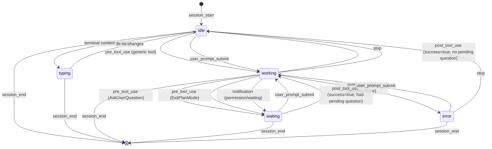

# Pane Status State Machine

This document describes how each pane is evaluated for status and what colors, labels, and notifications are used.

## Status Values

```
SessionStatus = 'idle' | 'typing' | 'working' | 'waiting' | 'error'
ProcessType   = 'claude' | 'shell' | 'process' | 'idle'
```

## Color and Label Mapping

| Status | Border Color | Background | Indicator | Label | Hex Values |
|--------|--------------|------------|-----------|-------|------------|
| `idle` | `rpg-idle/50` | `rpg-card` | `rpg-idle` | Idle | #8a7d6a |
| `typing` | `rpg-accent/70` | `rpg-accent/5` | `rpg-accent` | Active | #d9d7f9 |
| `working` | `rpg-working` | `rpg-card` | `rpg-working` | Working | #d7f7f9 |
| `waiting` | `rpg-waiting` | `rpg-waiting/10` | `rpg-waiting` | Waiting | #f9d9d7 |
| `error` | `rpg-error` | `rpg-error/10` | `rpg-error` | Error | #e57373 |

Non-Claude panes also use:
| ProcessType | Label |
|-------------|-------|
| `shell` | Shell |
| `process` | Running |

## State Machine Diagram



## Event Triggers

### Hook Events (from Claude Code)

| Event | Status Change | Details |
|-------|---------------|---------|
| `session_start` | → `idle` | New session initialized |
| `pre_tool_use` | → `working` | Tool execution starting |
| `pre_tool_use` (AskUserQuestion) | → `waiting` | Question pending |
| `pre_tool_use` (ExitPlanMode) | → `waiting` | Plan approval pending |
| `post_tool_use` (success) | → `idle` or `working` | Tool completed |
| `post_tool_use` (failure) | → `error` | Tool failed |
| `user_prompt_submit` | → `working` | User sent input |
| `notification` | → `waiting` | Permission prompt detected |
| `stop` | → `idle` | Session completed |
| `session_end` | (removed) | Session terminated |

### Terminal Activity Detection

```
Every 500ms per pane:
  - Compare terminal content hash
  - If changed and Claude pane is 'idle':
      status → 'typing'
      pane.process.typing = true
  - If no change for 3s and 'typing':
      status → 'idle'
      pane.process.typing = false
```

## Needs Attention

A pane "needs attention" when ALL of:
1. `pane.process.type === 'claude'`
2. `pane.process.claudeSession` exists
3. ANY of:
   - `session.status === 'waiting'`
   - `session.status === 'error'`
   - `session.pendingQuestion` is set

## Notification Triggers

### Critical (requireInteraction: true)

| Transition | Notification |
|------------|--------------|
| `* → waiting` | "{Name} needs input" |
| `* → error` | "{Name} error in {tool}" |

### Completion

| Transition | Notification |
|------------|--------------|
| `working → idle` | "{Name} finished" |

### Activity (non-Claude panes)

| Transition | Notification |
|------------|--------------|
| `inactive → active` | "Activity in {command}" |

## UI Visibility Rules

### Input Field

Shown when:
- Pane is expanded AND
- (Claude pane with status ≠ `working`) OR (non-Claude pane)

### Ctrl+C Button

Shown when:
- Pane is expanded AND
- (Claude pane with status = `working`) OR (process pane)

### Pending Question

Always visible when `session.pendingQuestion` is set.

### Error Details

Shown when:
- Claude pane with status = `error`
- `session.lastError` exists
- No pending question

## Visual Indicators

```
┌─────────────────────────────────────────┐
│ Status Indicator (dot)                  │
├─────────────────────────────────────────┤
│ idle     → static dot (muted brown)     │
│ typing   → pulsing dot (lavender)       │
│ working  → pulsing dot (cyan)           │
│ waiting  → static dot (pink)            │
│ error    → static dot (red)             │
└─────────────────────────────────────────┘

┌─────────────────────────────────────────┐
│ Border Treatment                        │
├─────────────────────────────────────────┤
│ idle     → subtle border (50% opacity)  │
│ typing   → accent border (70% opacity)  │
│ working  → solid cyan border            │
│ waiting  → solid pink border + bg tint  │
│ error    → solid red border + bg tint   │
└─────────────────────────────────────────┘
```

## Data Flow

```
┌──────────────────┐     ┌──────────────────┐
│   Claude Code    │     │      tmux        │
│     Hooks        │     │    (polling)     │
└────────┬─────────┘     └────────┬─────────┘
         │                        │
         │ POST /event            │ every 1s
         │                        │
         ▼                        ▼
┌─────────────────────────────────────────┐
│              Server                      │
│  ┌─────────────────────────────────┐    │
│  │    Claude Session Cache         │    │
│  │    (paneId → ClaudeSessionInfo) │    │
│  └─────────────────────────────────┘    │
│                                         │
│  handleEvent() → update session status  │
│  broadcastTerminalUpdates() → typing    │
└────────────────────┬────────────────────┘
                     │
                     │ WebSocket
                     ▼
┌─────────────────────────────────────────┐
│              Client                      │
│                                         │
│  useWindows() → windows with panes      │
│  PaneCard → statusTheme[status]         │
│  usePaneNotifications() → alerts        │
└─────────────────────────────────────────┘
```

## Key Files

| File | Responsibility |
|------|----------------|
| `server/index.ts:273-426` | Event processing, status transitions |
| `server/index.ts:454-551` | Terminal typing detection |
| `server/tmux.ts:137-253` | Process detection, session cache |
| `src/components/PaneCard.tsx:6-48` | Status theme, visual mapping |
| `src/components/OverviewDashboard.tsx:43-48` | needsAttention logic |
| `src/hooks/useNotifications.ts:70-179` | Notification triggers |
