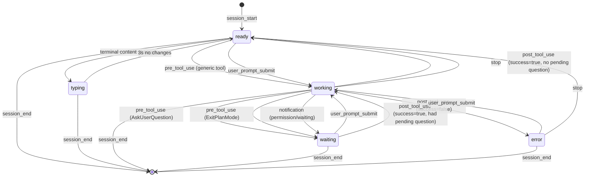

# Pane Status State Machine

This document describes how each pane is evaluated for status and what colors, labels, and notifications are used.

## Status Values

```
SessionStatus = 'ready' | 'typing' | 'working' | 'waiting' | 'error'
ProcessType   = 'claude' | 'shell' | 'process' | 'idle'
```

### Ready vs Waiting

Both states await user input, but differ in context:

| Status | Meaning | Visual |
|--------|---------|--------|
| **Ready** | Task complete, awaiting new prompt | Muted, no glow |
| **Waiting** | Mid-task, blocked on question/permission | Pink glow, attention badge |

`waiting` triggers notifications and "needs attention" badges because Claude is actively blocked.

## Color Palette

### Base Colors
| Token | Hex | Purpose |
|-------|-----|---------|
| `rpg-bg` | #31291b | Primary background (warm dark brown) |
| `rpg-card` | #3d352a | Card surfaces |
| `rpg-border` | #524736 | Borders |
| `rpg-text` | #f7f9d7 | Primary text (cream) |
| `rpg-text-dim` | #a09a7d | Secondary text |
| `rpg-accent` | #d9d7f9 | Interactive UI elements (lavender) |

### Status Colors
| Token | Hex | Status | Description |
|-------|-----|--------|-------------|
| `rpg-ready` | #8a7d6a | Ready | Muted brown - waiting for next step |
| `rpg-active` | #e8c547 | Active | Amber/gold - user typing activity |
| `rpg-working` | #d7f7f9 | Working | Cyan - Claude processing |
| `rpg-waiting` | #f9d9d7 | Waiting | Pink/salmon - needs user input |
| `rpg-error` | #e57373 | Error | Soft red - something failed |

### Other
| Token | Hex | Purpose |
|-------|-----|---------|
| `rpg-xp` | #f5d76e | XP display (warm gold) |
| `rpg-success` | #7ec9b8 | Success states (teal-green) |
| `rpg-idle` | #8a7d6a | Muted UI text (alias for ready) |

## Status → Visual Mapping

| Status | Label | Border | Background | Indicator | Pulses? |
|--------|-------|--------|------------|-----------|---------|
| `ready` | Ready | `rpg-ready/50` | `rpg-card` | `rpg-ready` | No |
| `typing` | Active | `rpg-active/70` | `rpg-active/5` | `rpg-active` | Yes |
| `working` | Working | `rpg-working` | `rpg-card` | `rpg-working` | Yes |
| `waiting` | Waiting | `rpg-waiting` | `rpg-waiting/10` | `rpg-waiting` | No |
| `error` | Error | `rpg-error` | `rpg-error/10` | `rpg-error` | No |

Non-Claude panes:
| ProcessType | Label |
|-------------|-------|
| `shell` | Shell |
| `process` | Running |

## State Machine Diagram



## Event Triggers

### Hook Events (from Claude Code)

| Event | Status Change | Details |
|-------|---------------|---------|
| `session_start` | → `ready` | New session initialized |
| `pre_tool_use` | → `working` | Tool execution starting |
| `pre_tool_use` (AskUserQuestion) | → `waiting` | Question pending |
| `pre_tool_use` (ExitPlanMode) | → `waiting` | Plan approval pending |
| `post_tool_use` (success) | → `ready` or `working` | Tool completed |
| `post_tool_use` (failure) | → `error` | Tool failed |
| `user_prompt_submit` | → `working` | User sent input |
| `notification` | → `waiting` | Permission prompt detected |
| `stop` | → `ready` | Session completed |
| `session_end` | (removed) | Session terminated |

### Terminal Activity Detection

```
Every 500ms per pane:
  - Compare terminal content hash
  - If changed and Claude pane is 'ready':
      status → 'typing'
      pane.process.typing = true
  - If no change for 3s and 'typing':
      status → 'ready'
      pane.process.typing = false
```

## Needs Attention

A pane "needs attention" when ALL of:
1. `pane.process.type === 'claude'`
2. `pane.process.claudeSession` exists
3. ANY of:
   - `session.status === 'waiting'`
   - `session.status === 'error'`
   - `session.pendingQuestion` is set

## Notification Triggers

### Critical (requireInteraction: true)

| Transition | Notification |
|------------|--------------|
| `* → waiting` | "{Name} needs input" |
| `* → error` | "{Name} error in {tool}" |

### Completion

| Transition | Notification |
|------------|--------------|
| `working → ready` | "{Name} finished" |

### Activity (non-Claude panes)

| Transition | Notification |
|------------|--------------|
| `inactive → active` | "Activity in {command}" |

## UI Visibility Rules

### Input Field

Shown when:
- Pane is expanded AND
- (Claude pane with status ≠ `working`) OR (non-Claude pane)

### Ctrl+C Button

Shown when:
- Pane is expanded AND
- (Claude pane with status = `working`) OR (process pane)

### Pending Question

Always visible when `session.pendingQuestion` is set.

### Error Details

Shown when:
- Claude pane with status = `error`
- `session.lastError` exists
- No pending question

## Visual Indicators

```
┌─────────────────────────────────────────┐
│ Status Indicator (dot)                  │
├─────────────────────────────────────────┤
│ ready    → static dot (muted brown)     │
│ typing   → pulsing dot (amber/gold)     │
│ working  → pulsing dot (cyan)           │
│ waiting  → static dot (pink) + glow     │
│ error    → static dot (red) + glow      │
└─────────────────────────────────────────┘

┌─────────────────────────────────────────┐
│ Border Treatment                        │
├─────────────────────────────────────────┤
│ ready    → subtle border (50% opacity)  │
│ typing   → amber border (70% opacity)   │
│ working  → solid cyan border            │
│ waiting  → solid pink border + bg glow  │
│ error    → solid red border + bg glow   │
└─────────────────────────────────────────┘
```

## Layout Structure

```
┌─────────────────────────────────────────┐
│ Window Header                           │
│ [index] windowName  repo  session  [n]  │
├─────────────────────────────────────────┤
│ ┌─────────────────────────────────────┐ │
│ │ Pane Card (attention first)         │ │
│ └─────────────────────────────────────┘ │
│ ┌─────────────────────────────────────┐ │
│ │ Pane Card                           │ │
│ └─────────────────────────────────────┘ │
└─────────────────────────────────────────┘
```

- Windows sorted: attention first, then by index
- Panes sorted: attention first, then Claude panes, then others
- Primary repo shown in window header if >50% of panes share it

## Data Flow

```
┌──────────────────┐     ┌──────────────────┐
│   Claude Code    │     │      tmux        │
│     Hooks        │     │    (polling)     │
└────────┬─────────┘     └────────┬─────────┘
         │                        │
         │ POST /event            │ every 1s
         │                        │
         ▼                        ▼
┌─────────────────────────────────────────┐
│              Server                      │
│  ┌─────────────────────────────────┐    │
│  │    Claude Session Cache         │    │
│  │    (paneId → ClaudeSessionInfo) │    │
│  └─────────────────────────────────┘    │
│                                         │
│  handleEvent() → update session status  │
│  broadcastTerminalUpdates() → typing    │
└────────────────────┬────────────────────┘
                     │
                     │ WebSocket
                     ▼
┌─────────────────────────────────────────┐
│              Client                      │
│                                         │
│  useWindows() → windows with panes      │
│  PaneCard → statusTheme[status]         │
│  usePaneNotifications() → alerts        │
└─────────────────────────────────────────┘
```

## Key Files

| File | Responsibility |
|------|----------------|
| `server/index.ts:273-426` | Event processing, status transitions |
| `server/index.ts:454-551` | Terminal typing detection |
| `server/tmux.ts:137-253` | Process detection, session cache |
| `src/components/PaneCard.tsx:6-22` | Status theme, labels |
| `src/components/OverviewDashboard.tsx:23-54` | needsAttention, getPrimaryRepo |
| `src/hooks/useNotifications.ts:70-179` | Notification triggers |
| `tailwind.config.js` | Color definitions |
